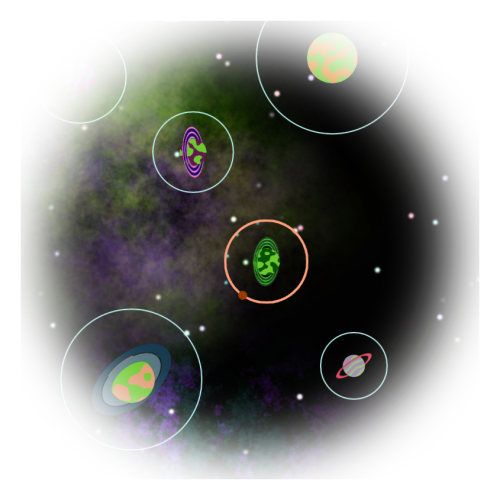

# Portfolio

- [Contact Details](#contact-details)
- [Personal Projects](#personal-projects)
- [Intro](#intro)
- [Looking For](#looking-for)
- [Skills](#skills)
- [Hobbies](#hobbies)
- [Education](#education)
- [Experience](#experience)
- [Employment](#employment)
- [References](#references)
- [In Closing](#in-closing)

## Contact Details

- **E-mail**: thomasdoyle09@gmail.com

## Personal Projects

The following links will take you directly to Github repos containing excerpts of data and assets from the given project. The README.md files in each area will attempt to give a rundown of what each folder contains, but feel free to peruse the files and ask questions (and feel free to provide feedback on anything that could be improved).

Many of the tools are not user-friendly as they were made for my personal use, but effort has been made to make them more understandable, and explanations are given.

| [**Medieval Battle Management Simulator**](https://github.com/ThomasDoyle11/medieval_battle_management_sim) | [**Orbit**](https://github.com/ThomasDoyle11/orbit) | [**Castle Kittens**](https://github.com/ThomasDoyle11/castle_kittens/) | [**WhatsApp Chat Analyser**](https://github.com/ThomasDoyle11/whatsapp_chat_analyser/) |
|:-:|:-:|:-:|:-:|
|  |  |  |  |
| C#, Unity, Python, Relational Database | C#, Unity, Shaders | C#, Unity, Asset Development | Python, Data Manipulation |

## Intro 

_skip if you don't want a summation of the past 5 years of my life_

I have excelled at Maths from a young age, but it wasn't until I was in University at the age of 20 that I realised I was specifically interested in coding and programming. More specifically, I was interested game development, but for a long time I thought that was an unattainable dream. However, after 5 years of working on my own projects and reaching the hurdles of apsects I struggle with, such as asset and UI design, I feel I have gained enough skills and would benefit from working in a team where I could exercise those skills in which I excel, practice those which I struggle with, and leave that which I am terrible at to the experts (after all, working in a team is all about recognising and capitalising on people's strengths, but I'm always happy to gain new skills).

## Looking For

I am looking for full-time or contract work in all aspects of game development, design and programming.

### For more information about me, see below in order of importance (in my humble opinion).

## Skills

- **Most relevant**: C#, Unity, Python, Git
- **Less relevant**: Matlab, SQL, HTML, Javascript, Java
- **Aspiring**: C++, Unreal
- **And of course**: Microsoft Office competency

## Hobbies

- Games (board, video, making my own)
- Programming Projects (see table at top of page for examples)
- Sports (tennis, rugby, running, cycling, swimming)
- Learning / practicing conversational French
- Charitable Work (£1000 collected in city centres for Meningitis Research, marathon)

## Education

- 1st Class MMath Mathematics Degree with Honours - University of Nottingham (**2013 - 2017**)
- 1st Class MSc Computer Science Degree with Honours - University of Nottingham (**2017 - 2018**)

## Experience

- Working with Python and C# in the Unity Engine on my own Programming Projects (see table at top of page for examples)
- Working in 4 different software teams over 18 months to aid engine projects (as part of a Graduate Scheme, I wasn't bounced around)
- _(Currently, for 9 months)_ Developing scripts in Python for engine verification
- The skills I've gained in working in a team during my 2+ years at Rolls Royce can't be understated and will certainly carry through to any future employment in the games development industry

## Employment

- **Sept 2018 - Present**: Software Engineer at Rolls Royce plc in Controls Systems

## References
- Available upon request

## In Closing

If any of the above information is unclear to you or you have any questions, please don't hesitate to contact me at the email provided above, or better still, invite me to an interview where we can have a more in-depth discussion.
